# 텔레그램 봇 생성 방법
1. 텔레그램에서 "BotFather" 를 검색합니다.<br />
&nbsp;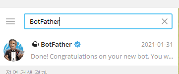
2. BotFather 와의 채팅방에서 /newbot 을 입력합니다. <br />
&nbsp;
3. Bot 의 이름을 입력합니다. <br />
&nbsp;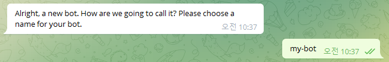
4. Bot 을 식별할 유니크한 이름을 입력합니다. (bot 으로 끝나야 합니다.) <br />
&nbsp;
5. 텔레그램봇 생성이 완료되었습니다. 화면에 표시된 token 을 기억해주세요.<br />
&nbsp;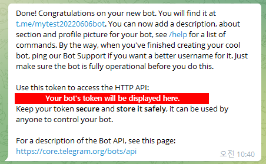

<br />
<br />

# 텔레그램 채널 ID 확인 방법
1. 텔레그램에서 채널을 생성합니다. (이미 존재하는 채널이 있다면 생략해주세요.)
2. 해당 채널에 방금전 만든 봇을 초대해주세요.<br />
&nbsp;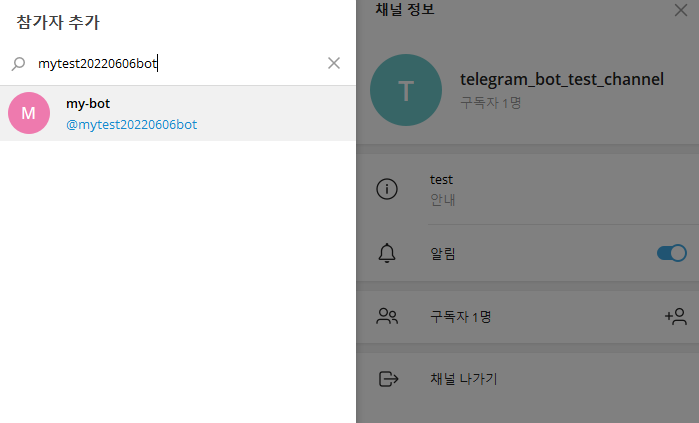

3. 브라우저 주소창에 다음과 같이 입력합니다.
```
https://api.telegram.org/bot{input-yout-bot-token}/getUpdates
``` 
&nbsp;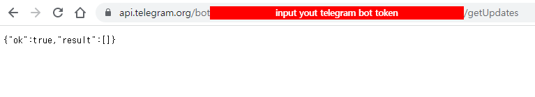

4. 봇을 초대한 채널에서 아무 메시지를 1개 올립니다.<br />
&nbsp;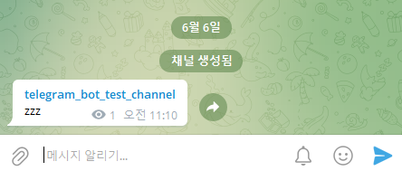

5. 채널에 아무 메시지나 올림과 동시에 사전에 열었던 브라우저를 새로고침 합니다.

6. 그러면 다음과 같이 채널 ID 를 확인 할 수 있습니다.<br />
&nbsp;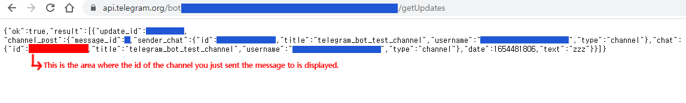

<br />
<br />

# 이 프로젝트 사용 방법
1. 본 프로젝트를 git clone 받습니다.
```
git clone https://github.com/wisdomstar94/telegram-bot-api.git
```
2. 클론 받은 프로젝트 경로로 이동합니다.
```
cd telegram-bot-api
```
3. node package 를 설치합니다.
```
npm i
```
4. 다음과 같이 파일을 copy 합니다.
```
cp .env.sample .env
cp src/customs/telegramButtonCallback.sample.js src/customs/telegramButtonCallback.js
cp src/customs/telegramButtonList.sample.js src/customs/telegramButtonList.js
```
5. .env 파일 안에 있는 값들을 적절히 수정해줍니다.

| 변수명 | 설명 |
| --- | --- | 
| COOKIE_SECRET_KEY | 쿠키 secret 값을 입력해주세요. |
| TELEGRAM_BOT_TOKEN | 텔레그램 봇 token 을 입력해주세요. |
| TELEGRAM_CHANNEL_ID | 텔레그램 채널 ID 를 입력해주세요. |

<br />
&nbsp;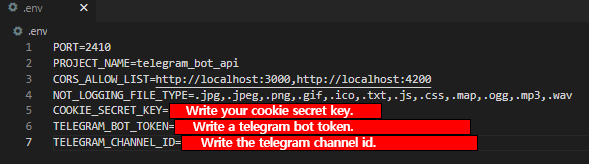

6. pm2 패키지를 전역으로 설치합니다.
```
npm i -g pm2
```
7. 다음 명령어를 입력하여 프로젝트를 구동합니다.
```
pm2 start pm2.config.js
```
&nbsp;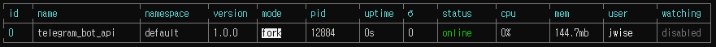

8. 아래 엔드포인트를 호출하면 텔레그램으로 메시지가 전송됩니다.
```
http://localhost:2410/telegram/bot/message/send
```
&nbsp;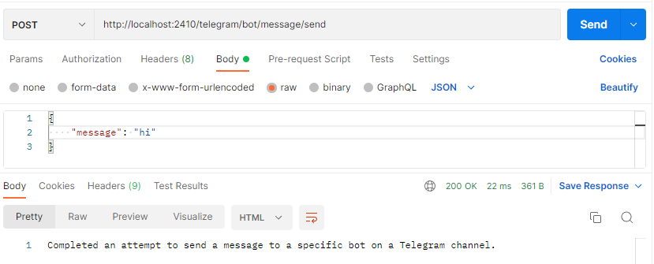<br />
&nbsp;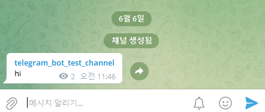

9. 메시지를 보낼 때 버튼도 같이 보내고 싶다면, http://localhost:2410/telegram/bot/message/send 을 호출할 때 isButtonShow 값을 true 로 보내면 됩니다. <br />
&nbsp;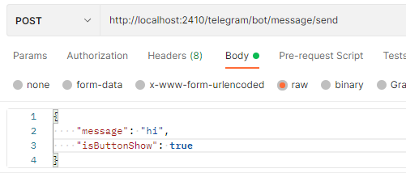<br />
&nbsp;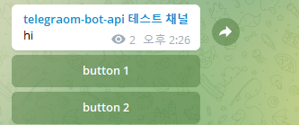

10. 버튼에 대한 커스텀을 하려면 "src/customs/telegramButtonList.js" 파일을 수정하면 되고, 버튼에 대한 콜백 이벤트를 커스텀 하려면 "src/customs/telegramButtonCallback.js" 파일을 수정하시면 됩니다.<br /><br />
&nbsp;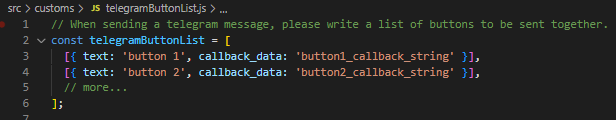<br /><br />
&nbsp;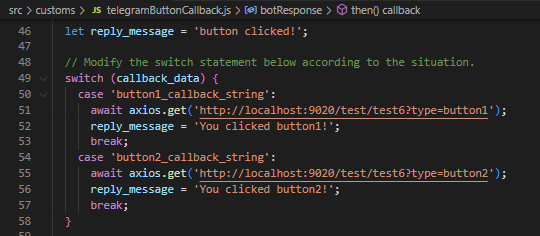
