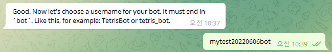

# How to create a telegram bot
1. Search for BotFather on Telegram. <br />
2. In the chat room with BotFather, type /newbot. <br />
3. Enter a name for your bot. <br />
4. Enter a unique name that identifies your bot. (Must end with bot.) <br />
5. Telegram bot creation is complete! Please remember the displayed token.<br />

<br />
<br />

# How to get the id of a telegram channel
1. Create a channel. (If the channel already exists, skip ahead.)
2. Invite the Telegram bot you made in advance to your channel.<br />
3. Enter the address below into the browser address bar.
```
https://api.telegram.org/bot{input-yout-bot-token}/getUpdates
``` 


4. Send any message to the channel where you invited the bot. <br />
5. At the same time as sending a message to the channel, refresh the page you opened earlier in your browser.
6. Then you can check the channel id like this.<br />

<br />
<br />

# How to use this project
1. git clone this project.
```
git clone https://github.com/wisdomstar94/telegram-bot-api.git
```
2. Move the path to the cloned project.
```
cd telegram-bot-api
```
3. Install the node package.
```
npm i
```
4. Copy the files like this:
```
cp .env.sample .env
cp src/customs/telegramButtonCallback.sample.js src/customs/telegramButtonCallback.js
cp src/customs/telegramButtonList.sample.js src/customs/telegramButtonList.js
```
5. Write the COOKIE_SECRET_KEY, TELEGRAM_BOT_TOKEN, TELEGRAM_CHANNEL_ID values ​​in the .env file.<br />
6. Install pm2 globally.
```
npm i -g pm2
```
7. Enter the following command to start the service.
```
pm2 start pm2.config.js
```


8. When you call the endpoint below, a message is sent to the telegram.
```
http://localhost:2410/telegram/bot/message/send
```
<br />


9. If you want to send a button when sending a message, you can send isButtonShow value to true when calling http://localhost:2410/telegram/bot/message/send api. <br /><br />


10. You can edit the "src/customs/telegramButtonList.js" file for button designation options and "src/customs/telegramButtonCallback.js" file for button callback options.<br /><br />
<br /><br />
